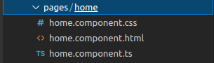
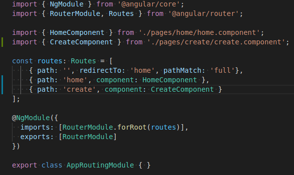
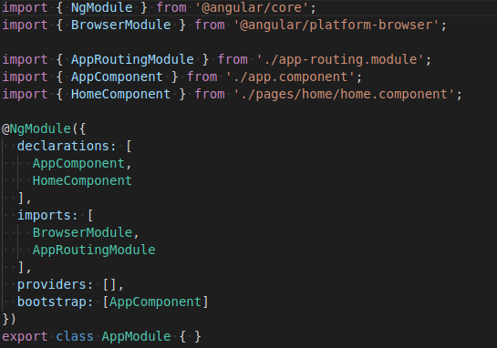
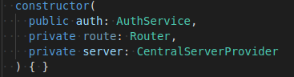
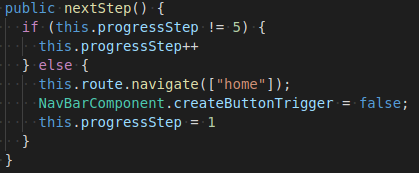

# [Workshop] Les requêtes API avec Angular
Voici les différentes étapes que vous pourrez apprendre durant ce **workshop**:
* Installer Angular
* Apprendre les bases en Angular
* Apprendre les bases en Typescript
* Apprendre à réaliser des requêtes API avec Angular

## Installation
Pour Angular nous allons installer la version 12 au lieu de la version 13 car la version 13 est sortis il y à pas longtemps et il peut y à avoir des problèmes de "deprecated dependencies" entre les différents package que vous installerez vu que ceux qui ont créent le package ne l'ont pas encore adapté à la nouvelle version d'Angular. <br/>

Si vous avez déja installer nodejs vous pouvez skip l'installation de nodejs. <br/>
Dans le cas où vous ne savez pas si vous l'avez installer vous pouvez le vérifier avec cette commande: <br/>

```nodejs -v```&emsp;ou&emsp;```npm -v```

### &emsp;Linux
&emsp;&emsp; **Nodejs** <br/>
&emsp;&emsp;&emsp;&emsp; **Fedora** <br/>
&emsp;&emsp;&emsp;&emsp;&emsp;&emsp; ```sudo dnf install nodejs```<br/>
<br/>
&emsp;&emsp;&emsp;&emsp; **Ubuntu** <br/>
&emsp;&emsp;&emsp;&emsp;&emsp;&emsp; ```sudo apt install nodejs```<br/>
&emsp;&emsp;&emsp;&emsp;&emsp;&emsp; ```sudo apt install npm```<br/>
<br/>
&emsp;&emsp;**TypeScript** <br/>
&emsp;&emsp;&emsp;&emsp;```npm install typescript```<br/>
<br/>
&emsp;&emsp;**Angular** <br/>
&emsp;&emsp;&emsp;&emsp;```npm install -g @angular/cli@12```<br/>
### &emsp;Window
&emsp;&emsp;&emsp;https://ccbill.com/kb/install-angular-on-windows#ftoc-heading-6

## Débuter avec Angular
### Création d'un projet Angular
```ng new "Nom du projet"``` <br/><br/>
Pour pouvoir réaliser le design de votre page web angular vous laissera le choix entre CSS, SCSS, SASS, LESS, je vous conseille de prendre CSS si vous ne conaissez pas les autres proposés.

après avoir créer votre projet vous devez installer les packages de Angular avec cette commande:<br/><br/>
```npm install```

### Creé un composant Angular
Un composant angular est un ensemble visuel composé (d'un fichier typescript, d'un fichier spec.ts, d'un fichier css et d'un fichier html). Vous pouvez suprimer le fichier spec.ts quand vous aurez créer le composant car vous n'en aurez pas besoin.<br/><br/>



Pour créer un composant il faut taper cette commande: <br/><br/>
```ng g c "nom du composant"```<br/>

### Lancer le site web
```ng serve```
### Fonctionnement du rooting en Angular
Le rooting pour faire court ça va être la navigation entre les différentes pages, on peut le configurer dans ```src/app/app-routing.module.ts```



là où vous pourrez créer vos roots sera dans la variable **routes**, celui-ci attends un path, un component (qui sera le composant que vous aurez créer) 

### Fonctionnement du module en Angular

Le module pour faire simple c'est un fichier qui va contenir tous vos packages, composant, services que vous souhaitez utiliser dans votre projet, si vous souhaitez utiliser un package il sera obligatoire que vous l'importiez d'abord dans le fichier **app-module.ts** qui se trouve dans ```src/app/app-module.ts``` avant de l'utiliser dans votre composant



### Contenu d'une classe
#### &emsp; Création des variables
&emsp;&emsp; Syntax pour déclarer une variable <br/>
&emsp;&emsp;&emsp;```private/public/protected "variable name": type```<br/>
#### &emsp; Constructeur <br/>
&emsp;&emsp;&emsp; principalement utilisé pour initialiser vos packages <br/>

&emsp;&emsp;&emsp;

#### &emsp; Méthode<br/>
&emsp;&emsp; ```public/private/protected "nom de la méthode"(): type de retour { //Contenu }``` <br/><br/>
&emsp;&emsp;&emsp;

## Débuter avec Typescript

## Réaliser une requête API avec Angular
